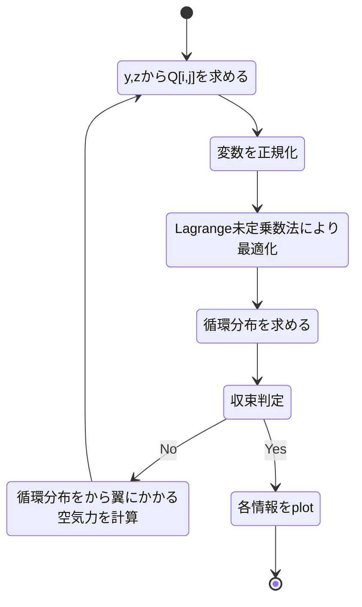

# TR797 ~ 非平面翼の最適設計

非平面翼の最適設計―揚力と翼根曲げモーメントを与えた時の最小誘導抵抗―
https://jaxa.repo.nii.ac.jp/?action=pages_view_main&active_action=repository_view_main_item_detail&item_id=45055&item_no=1&page_id=13&block_id=21

TR797の論文を参考に最適な循環分布を求めるプログラムを開発中です。
言語はPythonです。

## 現状

翼根の曲げモーメントと揚力による制約条件下で誘導抗力を最小化するような循環分布を求めることができます。


## TODO

* [x] 曲げモーメントによる変形をTrefftz面における翼の平面形にFeed backする
* [x] オブジェクト指向でコードをかく
* [ ] 翼型の最適化
* [ ] 翼平面における平面形を考慮
* [ ] テーパー比の変化の最適化
* [ ] 摩擦抗力
* [ ] 迎角

## FLOW CHART



<!-- ```mermaid
st=>start: 開始
e=>end: 終了
lo1=>inputoutput: y,zからQ[i,j]を求める
lo2=>inputoutput: 変数を正規化
lo3=>inputoutput: Lagrange未定乗数法により最適化
lo4=>inputoutput: 循環分布を求める
cond=>condition: 収束判定
io_sub1=>inputoutput: 循環分布をから翼にかかる空気力を計算
io_sub2=>inputoutput: 曲げモーメントからy,zを更新

op1=>operation: 各情報をplot

st->lo1->lo2->lo3->lo4->cond(yes)->op1->e
cond(no)->io_sub1(right)->io_sub2(top)->lo2
``` -->