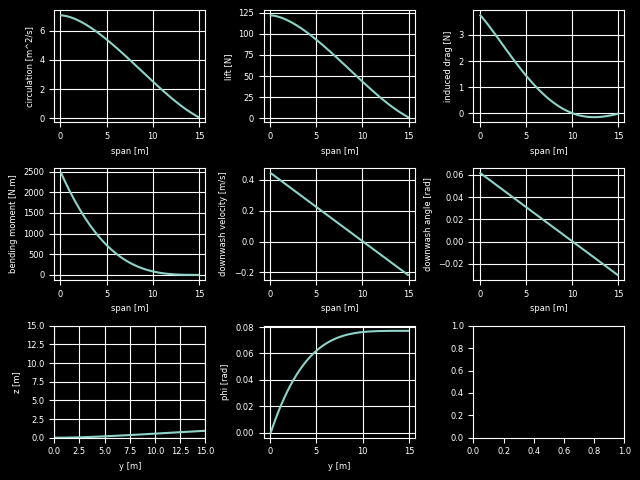

# TR797 ~ 非平面翼の最適設計

非平面翼の最適設計―揚力と翼根曲げモーメントを与えた時の最小誘導抵抗―
https://jaxa.repo.nii.ac.jp/?action=pages_view_main&active_action=repository_view_main_item_detail&item_id=45055&item_no=1&page_id=13&block_id=21

TR797の論文を参考に最適な循環分布を求めるプログラムを開発中です。
言語はPythonです。

## 現状

Trefftz面における翼の平面形が与えられれば、翼根の曲げモーメントと揚力による制約条件下で誘導抗力を最小化するような循環分布を求めることができます。

## TODO

* [ ] 曲げモーメントによる変形をTrefftz面における翼の平面形にFeed backする
* [ ] オブジェクト指向でコードをかく